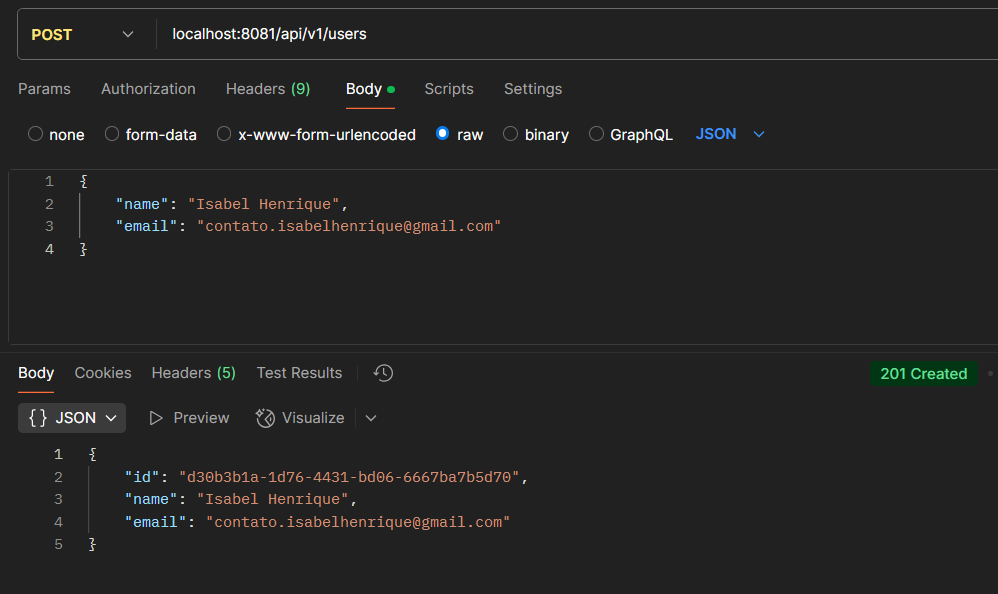
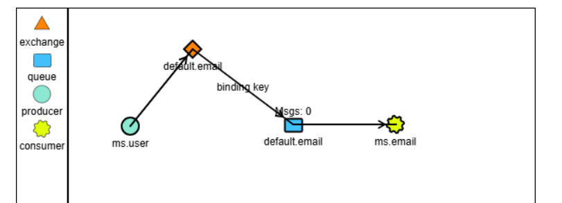

<h1 align="center">
  Email Notification Service
</h1>

## Descrição

- Um sistema de microsserviços que realiza o cadastro de usuários e envia notificações por e-mail de forma assíncrona via RabbitMQ.
- Este projeto é composto por dois microsserviços:
  - **ms-user**: serviço principal responsável pelo **cadastro de usuários**. 
  - **ms-email**: serviço responsável pelo envio de **e-mails de notificação**.
- Quando um novo usuário é criado pelo serviço ms-user, uma mensagem é enviada de via RabbitMQ (utilizando o broker Cloud AMQP). O serviço ms-email consome essa mensagem e envia um e-mail de boas-vindas por meio do servidor SMTP do Gmail.

## Tecnologias
- **Linguagem**: Java
- **Framework**: Spring Boot
- **Gerenciador de Dependências**: Maven
- **Banco de Dados**: PostgreSQL
- **Mensageria**: RabbitMQ
- **Broker na Nuvem**: Cloud AMQP
- **Serviço de E-mail**: SMTP Gmail

## Endpoint
```markdown
POST /users - Criação do usuário
```
<details>
    <summary><b>Exemplo</b></summary>
    
</details>

## Diagrama
<details>
    <summary><b>Diagrama de Mensageria</b></summary>
    
</details>

## Configuração e Execução
Pré-requisitos: Java 17 e Maven

1. clone o repositório
2. acesse o diretório do projeto
3. configure o banco de dados no application.properties
4. configure os dados de acesso ao RabbitMQ (Cloud AMQP)
5. configure as credenciais do servidor de e-mail (SMTP Gmail)

```bash
# instale as dependências do Maven
mvn clean install

# execute a aplicação
mvn spring-boot:run

# pressione (ctrl + c) para parar a aplicação
```

## Autor

- Projeto desenvolvido por [Isabel Henrique](https://www.linkedin.com/in/isabel-henrique/)
- Fique à vontade para contribuir!